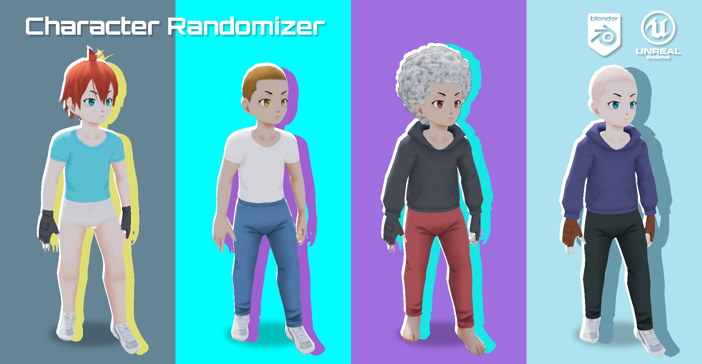
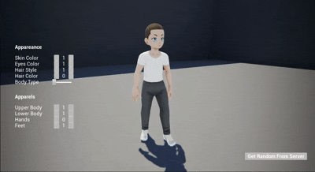
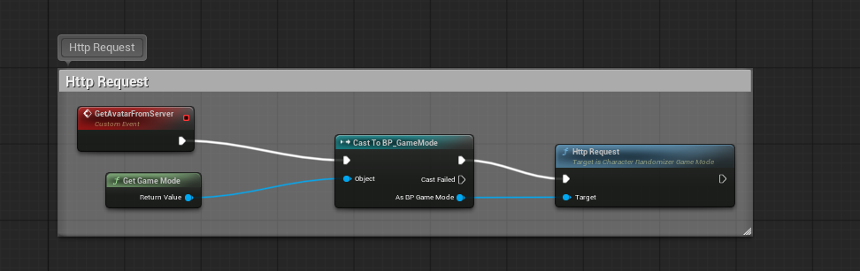
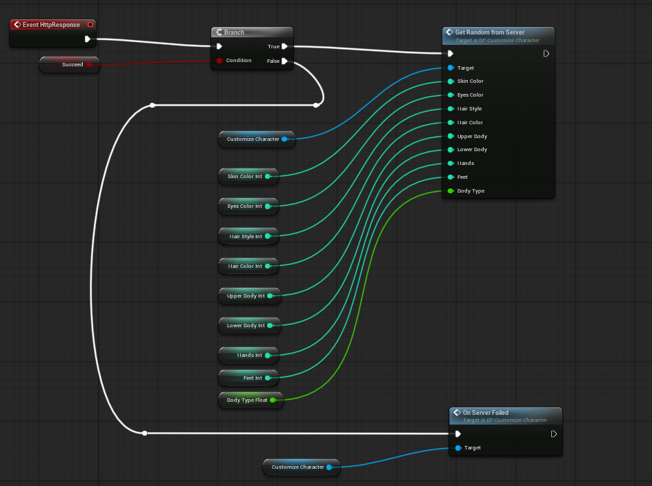
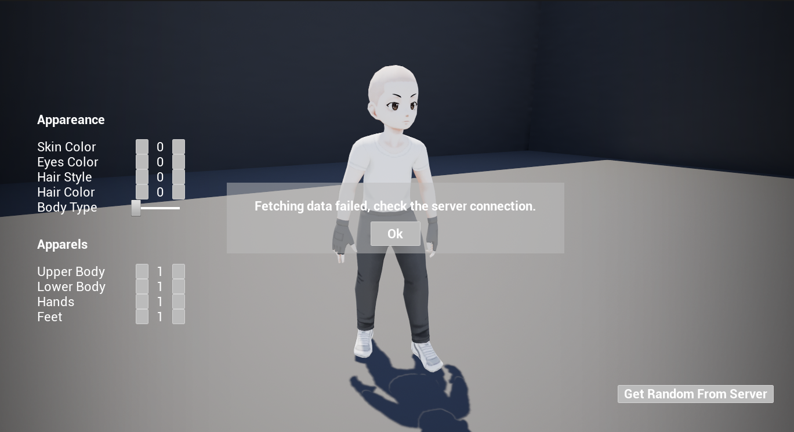

# Unreal Character Randomizer

A prototype Unreal Engine project that generates character appearance data from a local HTTP API and applies it in-engine.

## 📸 Showcase

  
  

## Overview

This project demonstrates a simple client/server flow:

- Unreal `./Source/CharacterRandomizer/CharacterRandomizerGameMode.*` uses `FHttpModule` and `FJsonSerializer`
- It sends a GET request to `https://localhost:44373/api/avatar`
- `./ServerLinux/Controllers/AvatarController.cs` returns randomized JSON DNA data
- Unreal parses the JSON and maps it into character appearance parameters such as:
  - `SkinColorInt`
  - `UpperBodyInt`
  - `LowerBodyInt`
  - `EyesColorInt`
  - `HairStyleInt`
  - `HairColorInt`
  - `HandsInt`
  - `FeetInt`
  - `BodyTypeFloat`

## How it works

1. `ACharacterRandomizerGameMode::HttpRequest()` creates and sends the HTTP request.
2. `ACharacterRandomizerGameMode::OnResponseReceived()` deserializes the JSON payload.
3. Blueprint-exposed properties are updated with the returned avatar definition.
4. `HttpResponse()` is called to trigger any Blueprint-side character update logic.

The function and events are exposed via Blueprints

  
  

When no data is retrieved, the read-only Success parameter is used to handle the client reply.

## Key files

- `./Source/CharacterRandomizer/CharacterRandomizerGameMode.h`
- `./Source/CharacterRandomizer/CharacterRandomizerGameMode.cpp`
- `./ServerLinux/Controllers/AvatarController.cs`
- `./ServerLinux/Program.cs`

## Run locally

1. Start the Linux API server in `./ServerLinux`
2. Run the Unreal project
3. Trigger `HttpRequest()` from Blueprint or game logic to refresh the character appearance

## Notes

The server API returns a character definition payload that Unreal consumes directly, making this a lightweight example of remote-driven character randomization.